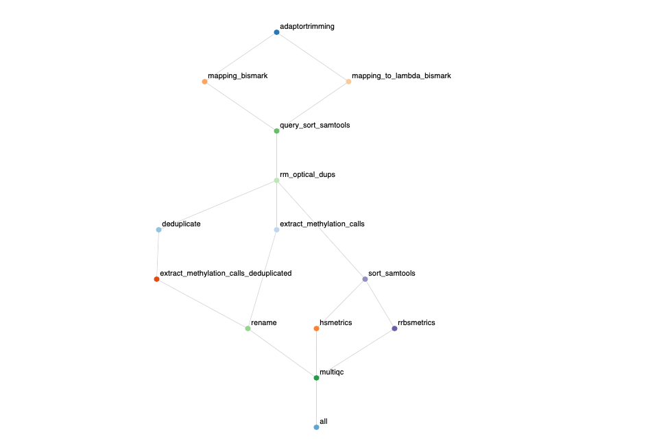

# BismarkPipeline v1.0.0

## Set-up
Install the pipeline with:
```bash
git clone git@github.ugent.be:DePreterLab/BismarkPipeline.git
cd BismarkPipeline/
(echo 3; echo a; echo PipelineDir="$PWD"; echo .; echo wq) | ed runBismarkPipeline_containers.sh
```

Then, create a conda environment to run snakemake using the following [yaml file](resources/environment.yml):

```
conda env create -f environment.yml
conda activate snakemake-6.1.0
```

## Required files
### Reduced representation (RR) reference genome
The reference genome can be converted in silico to an RR genome with [mkrrgenome](https://github.com/peterstockwell/DMAP). It needs to be run per chromosome, so first you have to convert your reference genome to individual chromosomes.

```bash
mkdir -p chromosomes

awk '/^>/{if (out){close(out)}; out="chromosomes/"substr($1,2)".fa"} {print >> out}' hg38.fa
```

Once this is done, you can run the following command, which scans the genome for MspI recognition sites (C′CGG) saving only those fragments that fall in the specified size range of 20-200 bp.

```bash
# If you are in the pipeline directory
./resources/mkrrgenome/meth_progs_dist/src/mkrrgenome -g ./chromosomes/chr -M 20,200 -m 20,200 > RRBS_regions20-200_hg19_chr.txt
```
Note that the chromosomes/ directory was previously generated to store the individual chromosome fasta files, while "chr" is the prefix of the individual chromosome fasta file (e.g. if chr1.fa, chr2.fa etc, adding "chr" will allow the script to scan files with this prefix, otherwise by default it will search for 1.fa,2.fa, etc).

Finally, you can run the following script to convert the region file to a bed format:

```python
python3 ../resources/mkrrgenome2bed.py -i RRBS_regions20-200_hg19_chr.txt -o RRBS_regions20-200_hg19_chr.bed
```

### Target file
The bed file generated above can be converted to an interval list, target file. The target file can be generated using the Picard [BedToIntervalList](https://gatk.broadinstitute.org/hc/en-us/articles/360036883931-BedToIntervalList-Picard) function, given a dictionary file in input for the corresponding genome. The dictionary can be generated using the Picard [CreateSequenceDictionary](https://gatk.broadinstitute.org/hc/en-us/articles/360037068312-CreateSequenceDictionary-Picard) using the fasta genome file (e.g. hg19.fa).

To run Picard HSmetrics, this target file is necessary. In the [resources](resources/) directory you can find 2 interval list files that contain all of the MspI regions between 20 and 200 bp in hg19 and hg38 genomes.


## Initiating the pipeline
To initiate the pipeline, navigate to a folder where you want to perform the analysis. This folder should only contain the `config_bismark.yaml` with the correct paths. Finally you can run the pipeline as reported in the [example bash script](runBismarkPipeline_containers.sh):

```bash
PipelineDir=/path/to/the/pipeline/folder
snakefile="${PipelineDir}/Bismark_pipeline_PE_containers.snakefile"
profile="${PipelineDir}/slurm_profile"
clusterTime="${PipelineDir}/clusterLong.json"

snakemake --use-singularity -s ${snakefile} --cluster-config ${clusterTime} --profile ${profile} --jobs 200 --rerun-incomplete
```

Optionally, you can specify a profile that you can use to optimally submit jobs in an HPC environment.

## Output
The output of the pipeline is a html report with the workflow (see `example-report.html`) and MultiQC.

## Contact
This pipeline was built by Ruben Van Paemel (Ruben.VanPaemel@ugent.be) and Andries De Koker (andries.dekoker@ugent.vib.be). [Edoardo Giuili](https://github.com/edogiuili) and [Sofie Van de Velde](https://github.com/sofvdvel) are the maintainers.

## Overview

